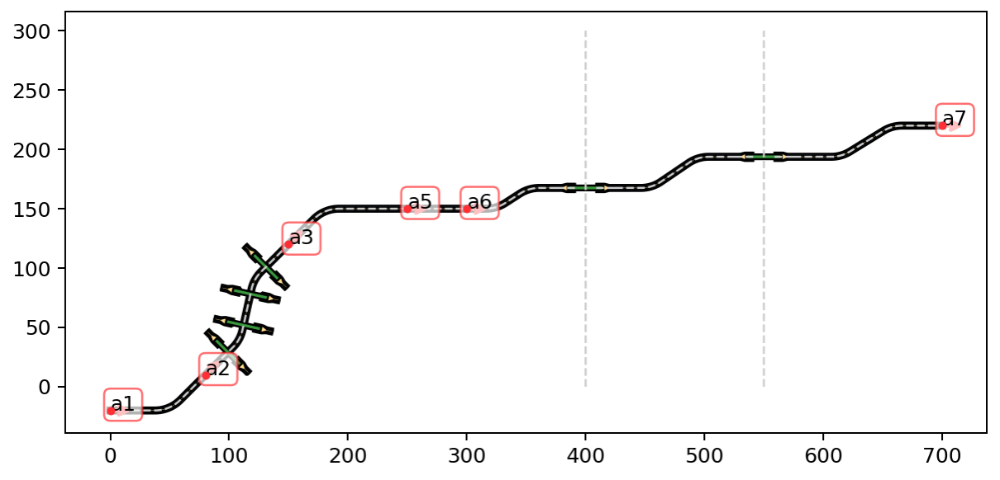
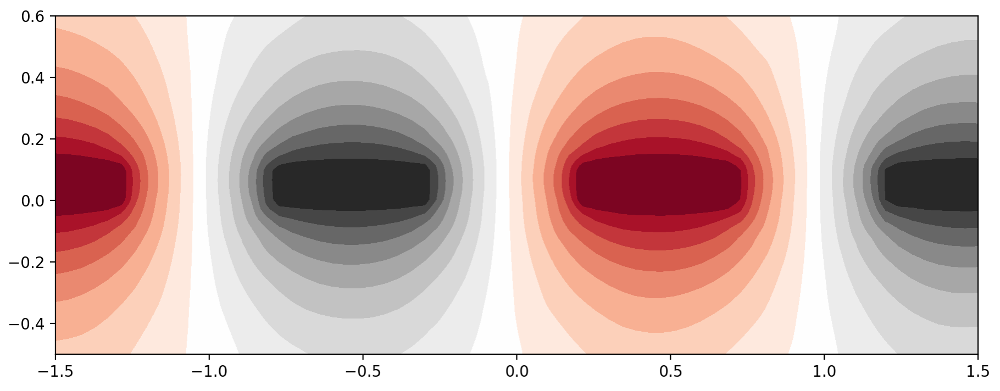

# ZeroHeliumKit

<p align="center">

</p>


ZeroHeliumKit is a Python module for planar geometry creation and manipulations designed for building microfabricated chips, and integrated electric field calculations. ZeroHeliumKit allows to create complex structure designs from simple geometries and assemble them in an intuitive Lego-style level. Geometry creation and assembly part is based on [Shapely](https://github.com/shapely/shapely) python package, which provides fast boolean operations on geometrical objects. ZeroHeliumKit enables simple integration with [Gmsh](https://gmsh.info) (mesh generation toolkit) and [FreeFEM++](https://freefem.org) (finite element solver for partial differential equations) to perform electric field calculations on designed geometrical structures. 


## Installing

After cloning repository, `cd` into the new directory and install neseccary packages:
```shell
pip install -r requirements.txt
```
Note, if you are on Windows or Mac and don’t already have `gdspy` installed, you will need a C++ compiler (in case if you have an error in installing this package):
* for Windows + Python 3, install the Microsoft [“Build Tools for Visual Studio”](https://visualstudio.microsoft.com/downloads/#build-tools-for-visual-studio-2019)
* For Mac, install “Xcode” from the App Store, then run the command `xcode-select --install` in the terminal

Next, install `zeroheliumkit` into your environment: 
```
pip install -e .
```
You can now open your python and run `import zeroheliumkit`. The final step is to install the latest FreeFEM++ software, which can be found [here](https://github.com/FreeFem/FreeFem-sources/releases).

## Usage

The easiest way to learn is through [examples](examples/)

Creating anchors and routes [anchors_routes](examples/anchors_routes.ipynb):
<p align="center">

</p>

Caculating electric field distribution in IDC [fem](examples/fem.ipynb):
<p align="center">

</p>

## Troubleshooting
#### Unresolved import warnings in Vscode
If you're getting a warning about an unresolved import, then create a file `.vscode/settings.json` in the workspace with the contents:
```json
{
    "python.analysis.extraPaths": ["./sources"]
}
```
Here a project uses a `sources` directory.